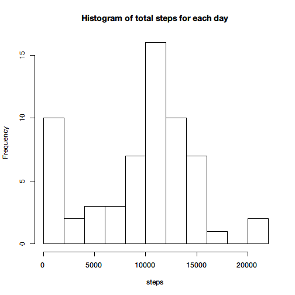
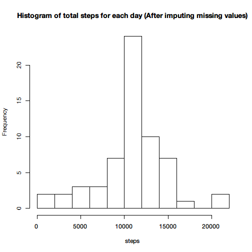
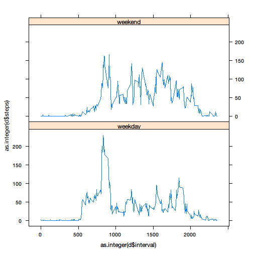

Peer Assignment 1
======================
#Load the data
Now load the CSV file.

```r
data <- read.csv('activity.csv')
```

#Mean total number of steps taken per day
##Total steps of each day
First, let's have a look at the distribution of the total steps taken per day.
In this section, the missing values will be ignored.

```r
split_data <- split(data, data$date)
sum_of_steps <- data.frame(sapply(split_data, function(x) sum(x$steps, na.rm = TRUE)))
colnames(sum_of_steps) <- 'steps'
hist(sum_of_steps$steps, breaks = 10, main = 'Histogram of total steps for each day', xlab = 'steps')
```

 

##Mean and Median total number of steps
Then calculate the mean and median total number of steps taken per day.

```r
mean_steps <- mean(sum_of_steps$steps)
median_steps <- median(sum_of_steps$steps)
print(paste('Mean:', mean_steps))
```

```
## [1] "Mean: 9354.22950819672"
```

```r
print(paste('Median:', median_steps))
```

```
## [1] "Median: 10395"
```

#Average daily activity pattern
##Time series plot
The following time series plot of the 5-minute interval will show the average number of steps taken, averaged across all days.

```r
split_data_interval <- split(data, data$interval)
average_steps <- data.frame(sapply(split_data_interval, function(x) mean(x$steps, na.rm = TRUE)))
average_steps$time <- rownames(average_steps)
colnames(average_steps) <- c('steps', 'time')
plot(as.integer(average_steps$time), average_steps$steps, type = 'l', main = 'Average number of steps averaged across all days', xlab='time', ylab='steps')
```

 

##The interval which contains the maximum number of steps
Next, find the 5-minute interval which contains the maximum number of steps.

```r
max_steps_interval <- average_steps[which(average_steps$steps == max(average_steps$steps)), 'time']
print(paste('The', max_steps_interval, 'interval contains the maximum number of steps.'))
```

```
## [1] "The 835 interval contains the maximum number of steps."
```

#Imputing missing values
##The total number of missing values
First, let's calculate the total number of missing values in the dataset.

```r
NA_number <- nrow(data[is.na(data$steps),])
print(paste('There are', NA_number, 'missing values.'))
```

```
## [1] "There are 2304 missing values."
```

##Fill in the missing values
Use the average number to fill in the missing value.

```r
filled_data <- data
for(i in 1:nrow(filled_data)){
    if(is.na(filled_data[i,'steps'])){
        interval = filled_data[i, 'interval']
        filled_data[i,'steps'] <- round(average_steps[which(average_steps$time == interval), 'steps'])
    }
}
head(filled_data)
```

```
##   steps       date interval
## 1     2 2012-10-01        0
## 2     0 2012-10-01        5
## 3     0 2012-10-01       10
## 4     0 2012-10-01       15
## 5     0 2012-10-01       20
## 6     2 2012-10-01       25
```

##Intuition of the filled data
Make a histogram of the total number of steps taken each day.

```r
split_filled_data <- split(filled_data, filled_data$date)
sum_of_steps_new <- data.frame(sapply(split_filled_data, function(x) sum(x$steps, na.rm = TRUE)))
colnames(sum_of_steps_new) <- 'steps'
hist(sum_of_steps_new$steps, breaks = 10, main = 'Histogram of total steps for each day (After imputing missing values)', xlab = 'steps')
```

 

And then calculate the mean and median total number of steps taken per day.

```r
mean_steps_new <- mean(sum_of_steps_new$steps)
median_steps_new <- median(sum_of_steps_new$steps)
print(paste('Mean(After imputing missing values):', mean_steps_new))
```

```
## [1] "Mean(After imputing missing values): 10765.6393442623"
```

```r
print(paste('Median(After imputing missing values):', median_steps_new))
```

```
## [1] "Median(After imputing missing values): 10762"
```

It's clear that these values are different from the estimates from the first part of the assignment.
After imputing the missing values, the distribution of the data approximates to a Gaussian distribution, which is different from the untreated data (with a larger bias). Obviously, the mean and median are also more approximate. This is an important feature of a no-bias distribution.

#Differences in activity patterns between weekdays and weekends
Create a factor variable in the dataset with two levels -- "weekday" and "weekend" indicating whether a given date is a weekday or weekend day. Make a panel plot containing a time series plot of the 5-minute interval (x-axis) and the average number of steps taken, averaged across all weekday days or weekend days (y-axis).

```r
library(lattice)
filled_data$date <- strptime(filled_data$date, format='%Y-%m-%d')
filled_data$weekdays <- weekdays(filled_data$date)
for(i in 1:nrow(filled_data)){
    if(filled_data[i,'weekdays'] %in% c('星期一','星期二','星期三','星期四','星期五')){
        filled_data[i,'type'] <- 'weekday'
    } else {
        filled_data[i,'type'] <- 'weekend'
    }
}
temp1 <- subset(filled_data, filled_data$type=='weekday')
temp2 <- subset(filled_data, filled_data$type=='weekend')
s1 <- split(temp1, temp1$interval)
s2 <- split(temp2, temp2$interval)
d1 <- data.frame(sapply(s1, function(x) mean(x$steps,na.rm = TRUE)))
d2 <- data.frame(sapply(s2, function(x) mean(x$steps,na.rm = TRUE)))
colnames(d1) <- 'steps'
colnames(d2) <- 'steps'
d1$interval <- rownames(d1)
d1$type <- 'weekday'
d2$interval <- rownames(d2)
d2$type <- 'weekend'
d <- rbind(d1,d2)
d$type <- factor(d$type)
xyplot(as.integer(d$steps) ~ as.integer(d$interval) | d$type, layout = c(1, 2), type='l')
```

 
